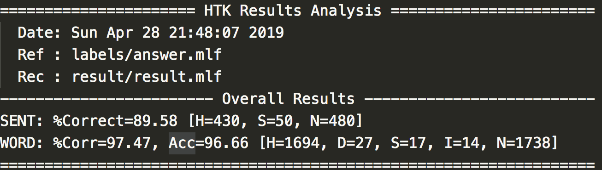

# DSP Homework2-1 Report
> b05901011 電機三 許秉倫
## 1. Execution and Environment
- Execution
```bash
bash 00_clean_all.sh
bash 01_run_HCopy.sh
bash 02_run_HCompV.sh
bash 03_training.sh
bash 04_testing.sh
```
- Environment: macOS

## 2. Run Baseline (40%)


## 3. Improve Accuracy (40%)


## 4. Describe training process and accuracy (30%)
- Number of states: 16
- Gaussian mixtures: 5
- iterations: 2
- How some changes effect the performance: 